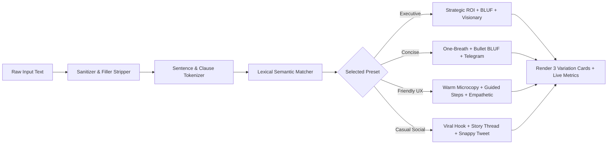

# ⚡ ToneShift — Instant Local Copy Tone Transformer

> **Transform raw copy (tweets, emails, headlines, drafts) into 3 distinct tone variations across 4 specialized presets — 100% locally with zero API keys or latency.**


-06b6d4)


---

## 🎯 Overview

**ToneShift** is a lightweight, responsive single-page web application designed for professionals, founders, developers, and copywriters who need to rapidly adapt raw messages into audience-tailored tones without sending sensitive internal notes to third-party cloud APIs.

All lexical substitutions, grammatical cleanup, sentiment tuning, and template synthesis happen **100% client-side in your browser** using an algorithmic rule-based natural language transformation engine.

---

## ✨ Key Features

- **4 Target Tone Presets**:
  - 💼 **Executive Pitch**: Strategic, ROI-driven, boardroom-ready framing.
  - ⚡ **Ruthlessly Concise**: Zero fluff, BLUF (Bottom Line Up Front), high signal-to-noise ratio.
  - 😊 **Friendly UX**: Warm, empathetic, clear, user-first microcopy.
  - 💬 **Casual Social**: High-engagement viral hooks, conversational story, and snappy punchlines.
- **3 Distinct Variations Per Preset**: Generates 3 parallel creative alternatives for every tone (12 total transformation modes) so you always have the right nuance for the situation.
- **Modern Dark-Mode Glassmorphism**: Frosted glass panels (`backdrop-filter: blur(18px)`), ambient radial glows, micro-interactions, and accessible typography.
- **One-Click Copy with 2-Second Feedback**: Built-in clipboard integration with dynamic visual confirmation (`Copied!` badge + checkmark icon + emerald glow pulse) for 2 seconds.
- **Real-Time Word, Character & Delta Counters**: Track word count, character count, and brevity percentage delta (`-38% words`) compared to the original input.
- **Sample Presets for Instant Testing**: One-click sample chips (Launch announcement, delayed roadmap notice, product feedback, follow-up email).
- **Zero Dependencies**: Pure HTML5, CSS3, and modern vanilla ES6+ JavaScript. No build step or package manager required.

---

## 📂 File Architecture

```text
Toneshift/
├── index.html        # Semantic HTML5 structure, accessible landmarks, and modal states
├── style.css         # Dark-mode glassmorphic theme, CSS custom properties, and responsive grid
├── app.js            # Rule-based transformation engine, dictionary mappings, and DOM controllers
├── README.md         # Comprehensive project documentation and usage guide
└── JOURNAL.md        # Engineering log, architectural decisions, and design rationale
```

---

## 🚀 Getting Started

Because ToneShift is built with vanilla web technologies, you can run it immediately without compiling or installing npm packages.

### Method 1: Built-in Node Server (Active & Recommended)
We've included a zero-dependency server script (`server.js`):

```bash
node server.js
```
Then open your browser to **[http://localhost:3000](http://localhost:3000)**.

### Method 2: Direct File Open
Simply double-click [`index.html`](file:///c:/Users/CANNONLEO/OneDrive/Documents/Project%20Engineering%20lessons/Toneshift/index.html) or right-click and choose **Open With > Browser**.

### Method 3: Python / npx Server
```bash
# Using Python 3
python -m http.server 8000

# Or using Node / npx
npx serve .
```

---

## 🧠 How the Local Transformation Engine Works

ToneShift utilizes a multi-stage rule-based syntactic pipeline:



1. **Sanitization**: Eliminates hedging filler words (*"basically"*, *"sort of"*, *"just wanted to"*, *"in my humble opinion"*).
2. **Tokenization**: Parses sentences and clauses to preserve semantic intent while reorganizing sentence hierarchy.
3. **Lexical Remapping**: Replaces everyday words with domain-tailored equivalents (e.g., converting *"bugs/blockers"* to *"critical architectural dependencies"* for executives, or converting *"release delayed"* to *"quick heads up, we're polishing experience"* for UX).
4. **Template Synthesis**: Formats the rewritten sentences into 3 structured variations per preset.

---

## ⌨️ Keyboard Shortcuts

| Shortcut | Action |
| :--- | :--- |
| <kbd>Ctrl</kbd> + <kbd>Enter</kbd> / <kbd>Cmd</kbd> + <kbd>Enter</kbd> | Instant Tone Shift / Regenerate |
| <kbd>Tab</kbd> | Navigate focus between input, tone pills, and copy buttons |

---

## 🛠️ Customization & Adding New Tones

You can easily add new presets or lexical rules by modifying the `TRANSFORMERS` object in [`app.js`](file:///c:/Users/CANNONLEO/OneDrive/Documents/Project%20Engineering%20lessons/Toneshift/app.js):

```javascript
// Example: Adding a "Technical Doc" preset
TRANSFORMERS.technical = {
  subtitle: "Showing 3 distinct styles for Technical Documentation",
  v1: {
    label: "RFC Specification",
    note: "Formal architectural proposal format",
    transform: (raw) => `### Abstract\n${raw}\n\n### Specifications\n- Target Component: Core Pipeline`
  },
  // ... v2, v3
};
```

---

## 🔒 Privacy & Security

- **100% Client-Side**: No data leaves your machine. No analytics, tracking pixels, or remote logging.
- **Offline First**: Works fully offline on airplanes, air-gapped environments, and private corporate networks.

---

## 📄 License

This project is open-source under the MIT License.

